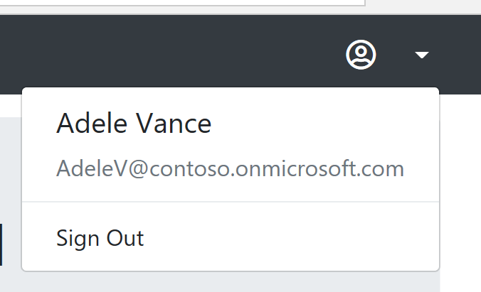

<!-- markdownlint-disable MD002 MD041 -->

在本练习中，你将扩展上一练习中的应用程序，以支持 Azure AD 的身份验证。 若要获取所需的 OAuth 访问令牌以调用 Microsoft Graph，这是必需的。 在此步骤中，将[omniauth-oauth2](https://github.com/omniauth/omniauth-oauth2) gem 集成到应用程序中，并创建自定义 omniauth 策略。

首先，创建一个单独的文件来保存您的应用程序 ID 和密码。 在`./config`文件夹中创建一个`oauth_environment_variables.rb`名为的新文件，并添加以下代码。

```ruby
ENV['AZURE_APP_ID'] = 'YOUR_APP_ID_HERE'
ENV['AZURE_APP_SECRET'] = 'YOUR_APP_SECRET_HERE'
ENV['AZURE_SCOPES'] = 'openid profile email offline_access user.read calendars.read'
```

将`YOUR_APP_ID_HERE`替换为应用程序注册门户中的应用程序 ID， `YOUR_APP_SECRET_HERE`并将替换为您生成的密码。

> [!IMPORTANT]
> 如果您使用的是源代码管理（如 git），现在可以从源代码管理中排除`oauth_environment_variables.rb`该文件，以避免无意中泄漏您的应用程序 ID 和密码。

现在，添加代码以加载此文件（如果存在）。 打开`./config/environment.rb`文件，并在`Rails.application.initialize!`行前面添加以下代码。

```ruby
# Load OAuth settings
oauth_environment_variables = File.join(Rails.root, 'config', 'oauth_environment_variables.rb')
load(oauth_environment_variables) if File.exist?(oauth_environment_variables)
```

## <a name="setup-omniauth"></a>安装 OmniAuth

你已安装了`omniauth-oauth2` gem，但为了使其能够使用 Azure OAuth 终结点，你需要[创建一个 OAuth2 策略](https://github.com/omniauth/omniauth-oauth2#creating-an-oauth2-strategy)。 这是一个 Ruby 类，用于定义用于向 Azure 提供程序发出 OAuth 请求的参数。

在`./lib`文件夹中创建一个`microsoft_graph_auth.rb`名为的新文件，并添加以下代码。

```ruby
require 'omniauth-oauth2'

module OmniAuth
  module Strategies
    # Implements an OmniAuth strategy to get a Microsoft Graph
    # compatible token from Azure AD
    class MicrosoftGraphAuth < OmniAuth::Strategies::OAuth2
      option :name, :microsoft_graph_auth

      DEFAULT_SCOPE = 'openid email profile User.Read'.freeze

      # Configure the Microsoft identity platform endpoints
      option  :client_options,
              site:          'https://login.microsoftonline.com',
              authorize_url: '/common/oauth2/v2.0/authorize',
              token_url:     '/common/oauth2/v2.0/token'

      # Send the scope parameter during authorize
      option :authorize_options, [:scope]

      # Unique ID for the user is the id field
      uid { raw_info['id'] }

      # Get additional information after token is retrieved
      extra do
        {
          'raw_info' => raw_info
        }
      end

      def raw_info
        # Get user profile information from the /me endpoint
        @raw_info ||= access_token.get('https://graph.microsoft.com/v1.0/me').parsed
      end

      def authorize_params
        super.tap do |params|
          params['scope'.to_sym] = request.params['scope'] if request.params['scope']
          params[:scope] ||= DEFAULT_SCOPE
        end
      end

      # Override callback URL
      # OmniAuth by default passes the entire URL of the callback, including
      # query parameters. Azure fails validation because that doesn't match the
      # registered callback.
      def callback_url
        options[:redirect_uri] || (full_host + script_name + callback_path)
      end
    end
  end
end
```

请花点时间查看此代码的功能。

- 它将设置`client_options`为指定 Microsoft identity platform 终结点。
- 它指定应在`scope`授权阶段发送参数。
- 它将用户`id`的属性映射为用户的唯一 ID。
- 它使用访问令牌从 Microsoft Graph 检索用户的配置文件，以填写`raw_info`哈希值。
- 它将重写回调 URL，以确保它与应用注册门户中的注册回调相匹配。

现在我们已定义策略，我们需要将 OmniAuth 配置为使用它。 在`./config/initializers`文件夹中创建一个`omniauth_graph.rb`名为的新文件，并添加以下代码。

```ruby
require 'microsoft_graph_auth'

Rails.application.config.middleware.use OmniAuth::Builder do
  provider :microsoft_graph_auth,
           ENV['AZURE_APP_ID'],
           ENV['AZURE_APP_SECRET'],
           scope: ENV['AZURE_SCOPES']
end
```

此代码将在应用程序启动时执行。 它将加载具有`microsoft_graph_auth`提供程序的 OmniAuth 中间件，并配置了中`oauth_environment_variables.rb`设置的环境变量。

## <a name="implement-sign-in"></a>实施登录

现在已配置 OmniAuth 中间件，您可以转到将登录添加到应用中。 在 CLI 中运行以下命令，以生成用于登录和注销的控制器。

```Shell
rails generate controller Auth
```

打开 `./app/controllers/auth_controller.rb` 文件。 将下列方法添加到 `AuthController` 类。

```ruby
def signin
  redirect_to '/auth/microsoft_graph_auth'
end
```

所有此方法都将重定向到 OmniAuth 预期调用我们的自定义策略的路由。

接下来，向`AuthController`类中添加回调方法。 OAuth 流完成后，OmniAuth 中间件将调用此方法。

```ruby
def callback
  # Access the authentication hash for omniauth
  data = request.env['omniauth.auth']

  # Temporary for testing!
  render json: data.to_json
end
```

现在，所有这些都是呈现由 OmniAuth 提供的哈希值。 在继续操作之前，我们将使用此操作来验证登录是否正常工作。 在测试之前，我们需要将路由添加到`./config/routes.rb`。

```ruby
get 'auth/signin'

# Add route for OmniAuth callback
match '/auth/:provider/callback', to: 'auth#callback', via: [:get, :post]
```

现在，更新视图以使用该`signin`操作。 打开`./app/views/layouts/application.html.erb`。 将行替换`<a href="#" class="nav-link">Sign In</a>`为以下代码行。

```html
<%= link_to "Sign In", {:controller => :auth, :action => :signin}, :class => "nav-link" %>
```

打开`./app/views/home/index.html.erb`文件，并将`<a href="#" class="btn btn-primary btn-large">Click here to sign in</a>`该行替换为以下代码。

```html
<%= link_to "Click here to sign in", {:controller => :auth, :action => :signin}, :class => "btn btn-primary btn-large" %>
```

启动服务器并浏览到`https://localhost:3000`。 单击 "登录" 按钮，您应会被重定向`https://login.microsoftonline.com`到。 使用你的 Microsoft 帐户登录，并同意请求的权限。 浏览器重定向到应用程序，显示由 OmniAuth 生成的哈希值。

```json
{
  "provider": "microsoft_graph_auth",
  "uid": "eb52b3b2-c4ac-4b4f-bacd-d5f7ece55df0",
  "info": {
    "name": null
  },
  "credentials": {
    "token": "eyJ0eXAi...",
    "refresh_token": "OAQABAAA...",
    "expires_at": 1529517383,
    "expires": true
  },
  "extra": {
    "raw_info": {
      "@odata.context": "https://graph.microsoft.com/v1.0/$metadata#users/$entity",
      "id": "eb52b3b2-c4ac-4b4f-bacd-d5f7ece55df0",
      "businessPhones": [
        "+1 425 555 0109"
      ],
      "displayName": "Adele Vance",
      "givenName": "Adele",
      "jobTitle": "Retail Manager",
      "mail": "AdeleV@contoso.onmicrosoft.com",
      "mobilePhone": null,
      "officeLocation": "18/2111",
      "preferredLanguage": "en-US",
      "surname": "Vance",
      "userPrincipalName": "AdeleV@contoso.onmicrosoft.com"
    }
  }
}
```

## <a name="storing-the-tokens"></a>存储令牌

现在，您可以获取令牌，现在是时候实现将它们存储在应用程序中的方法了。 由于这是一个示例应用程序，因此为简单起见，你将把它们存储在会话中。 实际应用程序将使用更可靠的安全存储解决方案，就像数据库一样。

打开 `./app/controllers/application_controller.rb` 文件。 你将在此处添加所有令牌管理方法。 由于其他所有控制器都会继承`ApplicationController`该类，因此它们可以使用这些方法访问令牌。

将下列方法添加到 `ApplicationController` 类。 该方法采用 OmniAuth 哈希作为参数并提取相关的信息位，然后将其存储在会话中。

```ruby
def save_in_session(auth_hash)
  # Save the token info
  session[:graph_token_hash] = auth_hash.dig(:credentials)
  # Save the user's display name
  session[:user_name] = auth_hash.dig(:extra, :raw_info, :displayName)
  # Save the user's email address
  # Use the mail field first. If that's empty, fall back on
  # userPrincipalName
  session[:user_email] = auth_hash.dig(:extra, :raw_info, :mail) ||
                         auth_hash.dig(:extra, :raw_info, :userPrincipalName)
end
```

现在，添加用于从会话中检索用户名、电子邮件地址和访问令牌的访问器函数。

```ruby
def user_name
  session[:user_name]
end

def user_email
  session[:user_email]
end

def access_token
  session[:graph_token_hash][:token]
end
```

最后，添加一些将在处理任何操作之前运行的代码。

```ruby
before_action :set_user

def set_user
  @user_name = user_name
  @user_email = user_email
end
```

此方法设置布局（in `application.html.erb`）用来在导航栏中显示用户信息的变量。 通过在此处添加它，无需在每个单个控制器操作中添加此代码。 但是，这也将对中的`AuthController`操作运行，这并不是最佳的。 将下面的代码添加到`AuthController`中`./app/controllers/auth_controller.rb`的类，以跳过 before 操作。

```ruby
skip_before_action :set_user
```

然后，更新`AuthController`类`callback`中的函数以存储会话中的标记，并重定向回主页面。 将现有的 `callback` 函数替换为以下内容。

```ruby
def callback
  # Access the authentication hash for omniauth
  data = request.env['omniauth.auth']

  # Save the data in the session
  save_in_session data

  redirect_to root_url
end
```

## <a name="implement-sign-out"></a>实现注销

在测试此新功能之前，请添加一种注销方式。将以下操作添加到`AuthController`类中。

```ruby
def signout
  reset_session
  redirect_to root_url
end
```

将此操作添加`./config/routes.rb`到。

```ruby
get 'auth/signout'
```

现在，更新视图以使用该`signout`操作。 打开`./app/views/layouts/application.html.erb`。 将此行`<a href="#" class="dropdown-item">Sign Out</a>`替换为：

```html
<%= link_to "Sign Out", {:controller => :auth, :action => :signout}, :class => "dropdown-item" %>
```

重新启动服务器并完成登录过程。 您应该最后返回到主页，但 UI 应更改以指示您已登录。


单击右上角的用户头像以访问 "**注销**" 链接。 单击 "**注销**" 重置会话并返回到主页。



## <a name="refreshing-tokens"></a>刷新令牌

如果您仔细查看 OmniAuth 生成的哈希值，您会注意到哈希中有两个标记`token` ： `refresh_token`和。 中`token`的值是访问令牌，它是在 API 调用的`Authorization`标头中发送的。 这是允许应用代表用户访问 Microsoft Graph 的令牌。

但是，此令牌的生存期较短。 令牌在发出后会过期一小时。 这是`refresh_token`值变得有用的地方。 刷新令牌允许应用在不要求用户重新登录的情况下请求新的访问令牌。 更新令牌管理代码以实现令牌刷新。

打开`./app/controllers/application_controller.rb`并在顶部添加`require`以下语句：

```ruby
require 'microsoft_graph_auth'
require 'oauth2'
```

然后，将以下方法添加到`ApplicationController`类中。

```ruby
def refresh_tokens(token_hash)
  oauth_strategy = OmniAuth::Strategies::MicrosoftGraphAuth.new(
    nil, ENV['AZURE_APP_ID'], ENV['AZURE_APP_SECRET']
  )

  token = OAuth2::AccessToken.new(
    oauth_strategy.client, token_hash[:token],
    refresh_token: token_hash[:refresh_token]
  )

  # Refresh the tokens
  new_tokens = token.refresh!.to_hash.slice(:access_token, :refresh_token, :expires_at)

  # Rename token key
  new_tokens[:token] = new_tokens.delete :access_token

  # Store the new hash
  session[:graph_token_hash] = new_tokens
end
```

此方法使用[oauth2](https://github.com/oauth-xx/oauth2) gem （ `omniauth-oauth2` gem 的依赖项）刷新标记，并更新会话。

现在，将此方法用于。 若要执行此操作， `access_token`请将`ApplicationController`类中的访问器设置得更聪明一点。 它将首先检查它是否接近到期，而不是仅从会话中返回令牌。 如果是，则在返回令牌之前将其刷新。 将当前`access_token`方法替换为以下项。

```ruby
def access_token
  token_hash = session[:graph_token_hash]

  # Get the expiry time - 5 minutes
  expiry = Time.at(token_hash[:expires_at] - 300)

  if Time.now > expiry
    # Token expired, refresh
    new_hash = refresh_tokens token_hash
    new_hash[:token]
  else
    token_hash[:token]
  end
end
```
