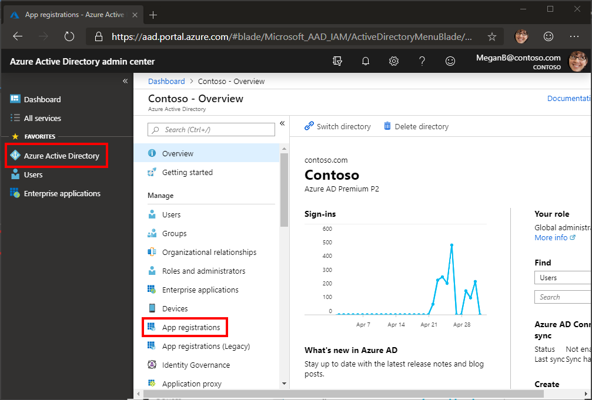
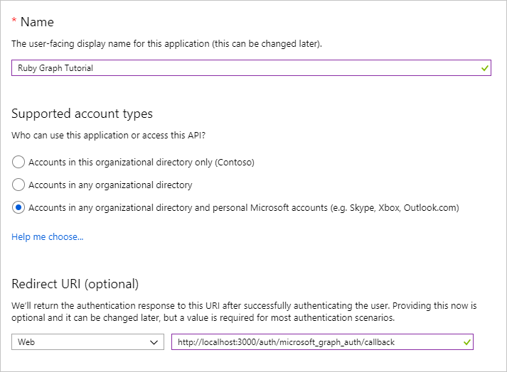

<!-- markdownlint-disable MD002 MD041 -->

在本练习中, 你将使用 Azure Active Directory 管理中心创建新的 Azure AD web 应用程序注册。In this exercise, you will create a new Azure AD web application registration using the Azure Active Directory admin center.

1. 打开浏览器，并转到 [Azure Active Directory 管理中心](https://aad.portal.azure.com)。Open a browser and navigate to the [Azure Active Directory admin center](https://aad.portal.azure.com). 使用**个人帐户**（亦称为“Microsoft 帐户”）或**工作或学校帐户**登录。Login using a **personal account** (aka: Microsoft Account) or **Work or School Account**.

1. 在左侧导航栏中选择 " **Azure Active Directory** ", 然后选择 "**管理**" 下的 "**应用程序注册**"。Select **Azure Active Directory** in the left-hand navigation, then select **App registrations** under **Manage**.

    

1. 选择“新注册”\*\*\*\*。Select **New registration**. 在“注册应用”\*\*\*\* 页上，按如下方式设置值。On the **Register an application** page, set the values as follows.

    - 将“名称”\*\*\*\* 设置为“`Ruby Graph Tutorial`”。Set **Name** to `Ruby Graph Tutorial`.
    - 将“受支持的帐户类型”\*\*\*\* 设置为“任何组织目录中的帐户和个人 Microsoft 帐户”\*\*\*\*。Set **Supported account types** to **Accounts in any organizational directory and personal Microsoft accounts**.
    - 在“重定向 URI”\*\*\*\* 下，将第一个下拉列表设置为“`Web`”，并将值设置为“`http://localhost:3000/auth/microsoft_graph_auth/callback`”。Under **Redirect URI**, set the first drop-down to `Web` and set the value to `http://localhost:3000/auth/microsoft_graph_auth/callback`.

    

1. 选择“注册”\*\*\*\*。Choose **Register**. 在 " **Ruby Graph 教程**" 页上, 复制**应用程序 (客户端) ID**的值并保存它, 下一步将需要它。On the **Ruby Graph Tutorial** page, copy the value of the **Application (client) ID** and save it, you will need it in the next step.

    

1. 选择“管理”\*\*\*\* 下的“证书和密码”\*\*\*\*。Select **Certificates & secrets** under **Manage**. 选择“新客户端密码”\*\*\*\* 按钮。Select the **New client secret** button. 在“说明”\*\*\*\* 中输入值，并选择一个“过期”\*\*\*\* 选项，再选择“添加”\*\*\*\*。Enter a value in **Description** and select one of the options for **Expires** and choose **Add**.

    

1. 离开此页前，先复制客户端密码值。Copy the client secret value before you leave this page. 将在下一步中用到它。You will need it in the next step.

    > [!IMPORTANT]
    > 此客户端密码不会再次显示，所以请务必现在就复制它。This client secret is never shown again, so make sure you copy it now.

    